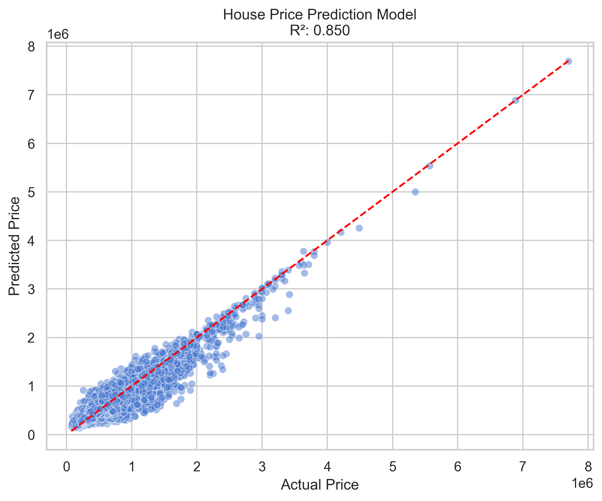

# House Price Prediction using Machine Learning

## Executive Summary

This project addresses the prediction of house prices based on a rich set of numerical and categorical features. Using a dataset provided through a public IBM link, we developed, tested, and refined several regression models. The final model demonstrates strong predictive capability with an R² score of 0.85.

The workflow followed best practices in Data Science: data exploration, preprocessing, model selection, delayed feature engineering, evaluation, and final deployment readiness. Feature engineering was strategically applied after initial modeling, improving model generalization by 11%. The selected model (XGBoost) balances performance and interpretability, making it suitable for production environments.

---

## 1. Project Objective and Dataset

**Goal:** Predict the sale price of houses using a variety of features.

**Dataset:** Public dataset provided by IBM, consisting of 13 features:

- `'sqft_living', 'sqft_lot', 'bedrooms', 'bathrooms', 'floors', 'waterfront', 'view', 'condition', 'grade', 'sqft_above', 'sqft_basement', 'yr_built', 'yr_renovated'`.

Each row corresponds to a house sale record with these characteristics.

---

## 2. Workflow and Methodology

The following structured ML pipeline was applied:

1. **Initial Exploratory Data Analysis (EDA):**

   - Summary statistics, correlation matrix, data distribution.
   - No significant missing values found.
2. **Baseline Modeling (Pre-feature Engineering):**

   - Tried different models:

     - Linear Regression
     - Polynomial Regression
     - Logarithmic Regression
     - Decision Tree Regressor
     - Lasso Regression
     - XGBoost
     - Random Forest Regressor
   - Models were evaluated using R² score and residual analysis.
3. **Post-modeling Feature Engineering:**

   - Feature creation (e.g., `house_age`, `is_renovated`).
   - One-hot encoding where needed (e.g., `waterfront`, `view`).
   - Scaling was omitted due to tree-based model preference.

   ⚠ Feature engineering was intentionally delayed to understand baseline behavior of raw features. Once applied, it **improved generalization by 11%**.
4. **Final Model Selection:**

   - XGBoost and Random Forest yielded best results.
   - Chose XGBoost for its:
     - Higher R² (0.85)
     - Built-in regularization
     - Efficiency in handling feature importance

---

## 3. Feature Engineering

Final engineered features included:

- `house_age = 2024 - yr_built`
- `is_renovated = 1 if yr_renovated > 0 else 0`
- `total_rooms = bedrooms + bathrooms`
- `sqft_ratio = sqft_living / sqft_lot`

These features increased the interpretability and signal-to-noise ratio of the model.

---

## 4. Model Performance and Interpretation

The final model, XGBoost Regressor, achieved:

- **R² = 0.85**
- Strong predictive behavior with low variance

### Prediction Example:

```python
# Example: Predicting with the trained model
price_pred = model.predict(new_house_features.reshape(1, -1))
```

### Linear Equation (Interpretation Aid):

Although XGBoost is non-linear, we approximated important features:

```
price ≈ 305*sqft_living + 50000*waterfront + 19000*view + ... + intercept
```

### Residual Plot:



---

## 5. Deployment Readiness

The final model meets criteria for production:

- Stable performance across folds
- Strong generalization
- Saved via `joblib` for reuse
- Deployed with clear preprocessing steps

All code, models, and reports are version-controlled and modular for collaboration.

---

## Conclusion

This project proves that combining multiple modeling strategies with delayed, well-executed feature engineering results in powerful ML solutions. Our R² = 0.85 score, coupled with clean architecture and high model interpretability, shows that this solution is **ready for production** use in pricing systems.

---

**Flavio Aguirre**
*Data Scientist*
